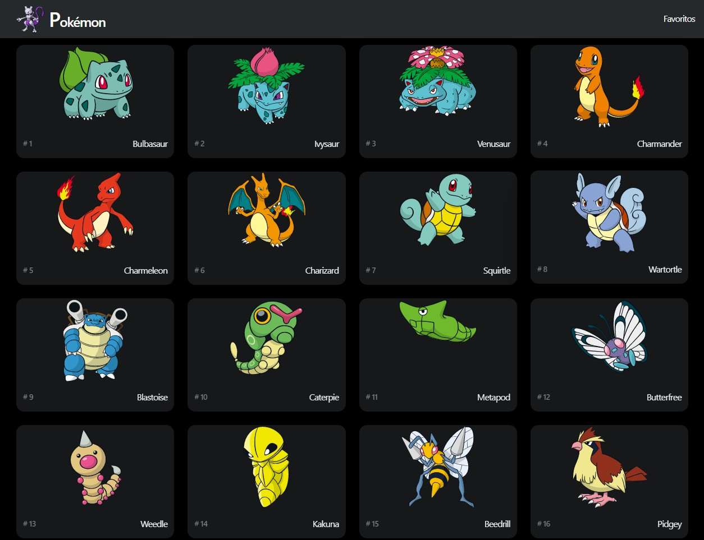
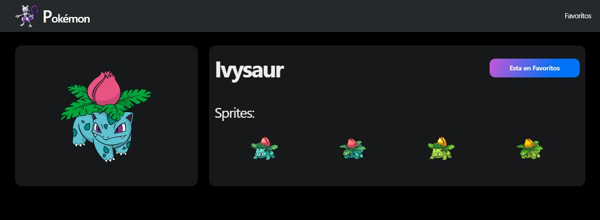

# App Pokemon

- Aplicación con Next, probando caracteristicas especiales de Next.js

## Desplegado en Vercel

- [Ver en linea](https://next-pokemon-app-beta.vercel.app/)

## Contenido de temas usados en este proyecto

1. Multiples componentes de NextUI

2. Theme Dark con NextUIProvider

3. Flex Layout

4. Temas de NextUI

5. Next _document

6. Navegación

7. Parámetros por URL

8. Parámetros estáticos

9. Next - GetStaticProps (SSG: Static-site generation)

10. Next - getStaticPaths

11. (ISG) - Incremental Static Generation:

12. (ISR) - Incremental Static Regeneration:

## NPM

    npm i @nextui-org/react": "^1.0.0-beta.9

## Enlaces

- `GetStaticPath` Rutas Dinámicas Utilizando
- [Next.js getStaticPaths](https://nextjs.org/docs/basic-features/data-fetching/get-static-paths)

- `GetStaticProps` Static Site Generation Utilizando
- [Next.js getStaticProps](https://nextjs.org/docs/basic-features/data-fetching/get-static-props)

- `ISR` Incremental static regeneration
- [Next.js Incremental Static Regeneration](https://nextjs.org/docs/basic-features/data-fetching/incremental-static-regeneration)

- `Meta data SEO`
- [Open Graph](https://ahrefs.com/blog/open-graph-meta-tags/)

## Vista Previa

## Notes

- IMG en caso de usar url de imagenes externas, agrega el dominio en el `next.config.js`

      const nextConfig = {
      reactStrictMode: true,
      images: {
        /* Arr of all allowed domains (in this case img) */
        domains: [ 'raw.githubusercontent.com' ],
        }
      }

- INDEX BARRIL en caso necesites usar exportaciones por defecto en un archivo de barril debes exportarlo:

      export { default as pokeApi } from './pokeApi'

- `(STATIC)` "Automatically rendered as static HTML" significa que el contenido se genera automáticamente en forma de archivos HTML estáticos sin ninguna interacción o procesamiento adicional. Esto implica que el contenido se genera una vez y luego se almacena como un archivo HTML estático, que luego se sirve directamente al usuario sin modificaciones o personalizaciones adicionales.

- `(SSG)` "automatically generated as static HTML + JSON " implica que el contenido se genera automáticamente, pero puede haber algún procesamiento o personalización adicional antes de que se almacene como un archivo HTML estático. Esto puede incluir la generación dinámica del contenido en función de ciertos parámetros o condiciones, pero una vez generado, se guarda como un archivo HTML estático que se sirve al usuario sin más procesamiento (no hara mas peticiones http).

    En resumen, la diferencia principal radica en si el contenido se genera completamente sin ninguna modificación adicional antes de guardarlo como un archivo HTML estático ("automatically rendered as static HTML"), o si se genera automáticamente con algún procesamiento o personalización adicional antes de guardarlo como un archivo HTML estático ("automatically generated as static HTML").

- EXAMPLE (getStaticPaths) return:

      return {
        paths: [
           {
             params: { id: '1' }
           },
        ],
      }

- `(ISR)` Incremental Static Regeneration:
ISR es una técnica utilizada en frameworks y plataformas de generación estática, como Next.js, para regenerar de manera incremental partes específicas de una página estática en tiempo de ejecución, sin tener que reconstruir toda la página. Esto permite actualizar contenido en tiempo real o programado, manteniendo la mayoría del sitio como contenido estático pregenerado. Cuando se realiza una solicitud a una página con ISR habilitado, se sirve la versión estática pregenerada inicialmente, pero también se inicia un proceso en segundo plano para regenerar ese contenido estático para futuras solicitudes. Esto permite que el contenido se actualice sin necesidad de reconstruir toda la página en cada actualización.

- `(ISG)` Incremental Static Generation:
ISG se refiere a la capacidad de generar de forma incremental contenido estático en tiempo de compilación. En lugar de generar todo el contenido estático de una vez, se generan partes específicas o secciones del sitio de manera incremental a medida que los datos o contenido se actualizan. Esto es especialmente útil en casos donde ciertas secciones del sitio cambian con más frecuencia que otras. Al utilizar ISG, se puede mejorar el tiempo de construcción y el rendimiento general del sitio, ya que no es necesario volver a generar todo el contenido estático en cada actualización.

**En resumen**, ISR se centra en la regeneración incremental de contenido estático en tiempo de ejecución, mientras que ISG se refiere a la generación incremental de contenido estático en tiempo de compilación. Ambas técnicas tienen como objetivo permitir actualizaciones eficientes y en tiempo real en aplicaciones web estáticas.
